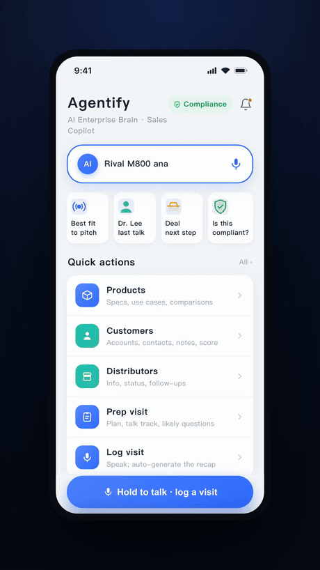

# OpenClaw Product Branding Skill

  
   8-second excerpt from a 60s promo generated end-to-end by this skill

Turn a product (a few UI screenshots/mockups + a one-line value prop) into a **60-second vertical brand promo video** — end to end, locally, with no video editor.

Pipeline: **script → high-fidelity HTML reproduction of the product UI with "hero" animations → real-person painpoint B-roll (KIE image + Seedance i2v) → headless-Chrome screen recording → ffmpeg assembly with HTML-rendered captions → Doubao TTS voiceover + BGM mux → Feishu delivery.** Also handles "rebrand an existing demo and re-export".

Why it exists: product demos sell on *credibility*. Design mockups become clickable HTML prototypes that really animate, so the footage looks like the actual app in use — far more convincing than motion-tweening static PNGs.

## Use it
Read `SKILL.md`. Check the toolchain with `scripts/check_env.sh`, then work the stages. Scripts are working templates — adapt the config arrays at the top of `capture.js` / `build.sh` / `gen_vo.sh` to your project.

## Requirements
ffmpeg (libx264), node + playwright (or system Chrome via `channel:'chrome'`), `KIE_API_KEY`, `DOUBAO_TTS_KEY`, optional `lark-cli`. **All keys via env — never commit a key.**

## Layout
- `SKILL.md` — the method
- `scripts/` — check_env, kie, capture, build, tts, gen_vo
- `assets/caption.html` — transparent caption renderer (`**bold**` = highlight)
- `references/` — ui-prototype, kie-api, doubao-tts, feishu-delivery, pipeline-gotchas

MIT licensed.
